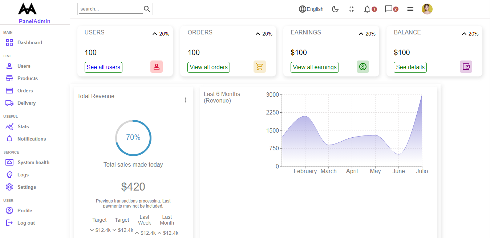
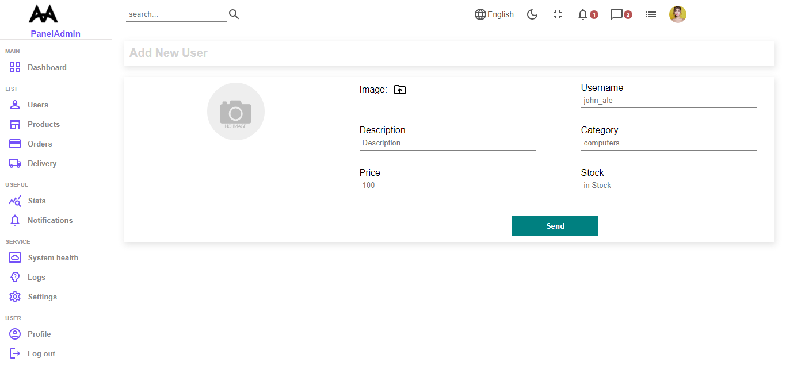
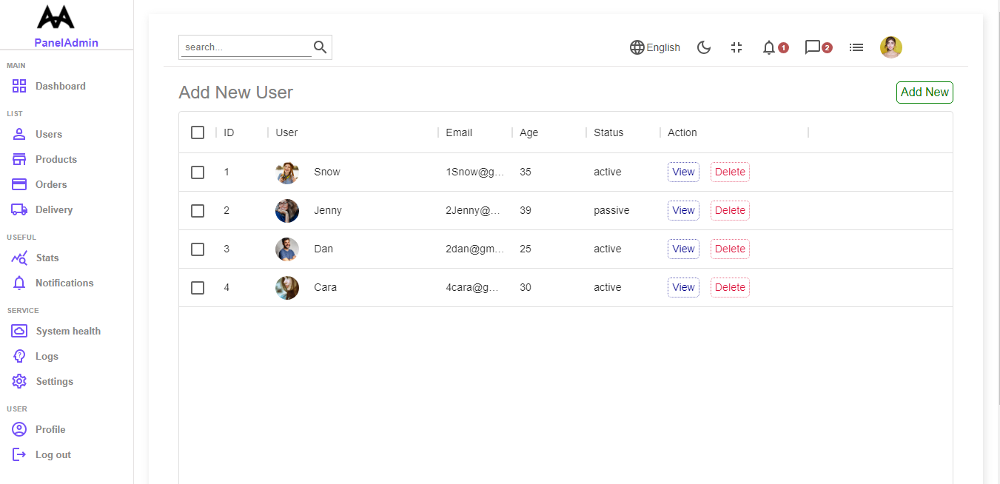

# Panel_Administrador (FRONT-END)

## Tecnologías Utilizadas

+ React
+ JavaScript
+ HTML
+ CSS
+ MUI

## Descripción

Este es un ejemplo práctico de un panel de administrador creado con React, el cual suele adherirse a una aplicacion aun mas grande, como un E-commerce. 

Éste tiene una barra de navegación, un sidebar y un inicio que resume toda la informacion importante que contiene el mismo.

Este sitio permite agregar usuarios de forma individual y verlos registrados en una tabla.

## Como se ve Panel_Administrador

+ ### Inicio

+ ### Creacion de usuarios

+ ### Usuarios 

